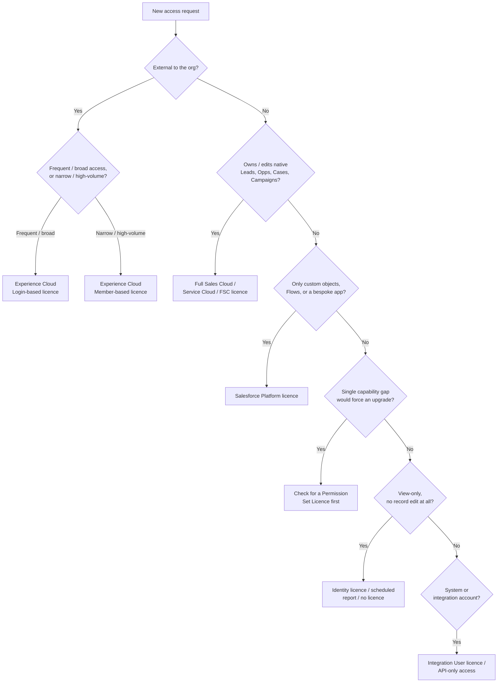

# Salesforce Licence Optimisation & Planning Framework

> **Architecture artefact — portfolio example.** A worked example of the licence-planning artefact a Salesforce Architect produces during implementation planning, at phase gates, and ahead of renewal: persona-to-licence mapping, a selection decision framework, optimisation levers, and the governance model that keeps it accurate over time.

| | |
|---|---|
| **Document Title** | Salesforce Licence Optimisation & Planning Framework |
| **Document Type** | Architecture Artefact — Reference Example |
| **Prepared By** | Solution / Platform Architecture Function |
| **Audience** | Delivery Leads, Salesforce Administrators, Business Sponsors, Procurement |
| **Applies To** | New implementations, phase gate reviews, and annual licence renewal cycles |
| **Status** | Illustrative Template — adapt figures, personas and licence names to your org's live edition catalogue |

📄 A formatted Word version of this artefact is included in this folder: [`Salesforce_Licence_Optimisation_Planning_Framework.docx`](./Salesforce_Licence_Optimisation_Planning_Framework.docx)

---

## Contents

- [1. Purpose & Scope](#1-purpose--scope)
- [2. Guiding Principles](#2-guiding-principles)
- [3. Salesforce Licence Landscape](#3-salesforce-licence-landscape)
- [4. Persona-to-Licence Mapping](#4-persona-to-licence-mapping)
- [5. Licence Selection Decision Framework](#5-licence-selection-decision-framework)
- [6. Optimisation Levers](#6-optimisation-levers)
- [7. Governance & Ongoing Management](#7-governance--ongoing-management)
- [8. Risks & Anti-Patterns](#8-risks--anti-patterns)
- [9. Appendix](#9-appendix)

---

## 1. Purpose & Scope

Salesforce licence cost scales with headcount and with the breadth of capability each seat is entitled to — and in most orgs it's one of the largest recurring line items tied directly to platform decisions. Unlike storage or API limits, licence mis-allocation rarely triggers an error message; it just quietly costs money every renewal cycle. This artefact exists to make licence planning a deliberate, reviewable design decision rather than an afterthought of user provisioning.

It's produced (and revisited) at three points in the platform lifecycle:

- **During implementation planning** — before the edition and licence bundle is contracted, so the architecture is sized to the real personas, not a guess.
- **At each significant phase gate** — when a new user population (a department, an external community, an acquisition) is being onboarded.
- **Ahead of annual renewal** — so utilisation data drives the negotiation instead of the previous year's invoice being renewed by default.

> **Guiding Principle**
> Every user gets the least amount of access required to do their job, and no access at all if the platform isn't required for that job. This is not just a cost control — it materially reduces the org's data exposure and audit surface too.

## 2. Guiding Principles

- **Need-driven, not role-title-driven** — a user's licence is determined by what they actually do in Salesforce, not their seniority or job title. A director who only views dashboards costs the same to over-license as a junior analyst.
- **Narrowest sufficient licence** — start from Platform / Guest / Experience Cloud and justify an upgrade, rather than starting from a full licence and hoping nobody asks why.
- **Permission Set Licences before base licence upgrades** — a single missing capability should not force a full seat upgrade if a PSL covers it.
- **Licence state mirrors employment state** — joiner/mover/leaver processes must touch licence assignment automatically, not as a manual afterthought.
- **One inventory, one owner** — licence entitlement, assignment and utilisation are tracked in a single place with a named owner, not scattered across spreadsheets and tribal knowledge.
- **Reviewed on a cadence, not just at renewal** — utilisation drifts constantly as teams reorganise; quarterly review catches it while it's cheap to fix.

## 3. Salesforce Licence Landscape

Before personas can be mapped, the architect needs a shared, current inventory of what's actually available in the org's edition and contract — licence names, entitlement counts and renewal dates change often enough that this should be validated against the live Company Information page and the Order Form, not assumed from memory.

| Category | Purpose & Examples | Typical Cost Position |
|---|---|---|
| **Core / Base User Licences** | Determine the standard objects and UI a user gets: Salesforce (full CRM), Sales Cloud, Service Cloud, Financial Services Cloud, Salesforce Platform (custom objects and a restricted set of standard objects, no native Leads/Opportunities/Cases/Campaigns). | Highest — the primary lever for per-seat cost control. |
| **Permission Set Licences (PSLs)** | Unlock a discrete capability for a subset of users without upgrading their base licence, e.g. Service Cloud PSL for a Platform user who occasionally needs Case access, Sales Cloud PSL, Identity PSL, Data Cloud PSL, Field Audit Trail PSL. | Moderate — usually far cheaper than upgrading the base licence and directly traceable to a business capability. |
| **Feature Licences** | Legacy-style single-purpose add-ons, e.g. Marketing User, Work.com, Partner Central User (declining in favour of PSLs on newer clouds). | Low–moderate — often bundled or included depending on edition. |
| **Experience Cloud Licences** | External-facing digital experiences. Priced either per named login (login-based) or per registered member with capped logins (member-based) — the choice materially changes cost at scale. | Variable — usually the largest optimisation opportunity for orgs with large external populations. |
| **Guest User Licence** | Unauthenticated access to public pages/forms within an Experience Cloud site. No named user, governed entirely by the Guest User profile's sharing and FLS. | Included with the site — but a common source of accidental data exposure if over-permissioned. |
| **Chatter Free / Chatter External** | Collaboration-only access (feed, groups, files) for people who need zero record access. | Low — frequently underused as a downgrade path for inactive full-licence users. |
| **Add-On Platform Products** | Licensed independently of the user licence model: CRM Analytics, Shield (Platform Encryption / Event Monitoring / Field Audit Trail), Data Cloud credits, Flow orchestration limits. | Often consumption- or org-based rather than per-seat — needs separate governance from the user licence review. |

**Financial services note:** Financial Services Cloud is licensed as an add-on on top of a base Sales/Service Cloud user licence (or as its own FSC licence type, depending on contract vintage) — it is not free capability layered onto Platform. Person Accounts, Household, and Financial Account data models are enabled by the FSC licence and add-on, and should be scoped explicitly rather than assumed to be "part of Salesforce."

## 4. Persona-to-Licence Mapping

The core working artefact — a living matrix, not a one-off exercise. Personas below are illustrative of a wealth/financial-services platform; the pattern (**need → licence → rationale**) is what should be reused for any org.

🟢 Clear fit &nbsp;·&nbsp; 🟡 Needs a sizing decision &nbsp;·&nbsp; 🔴 Common over-provisioning risk

| Persona | Primary Need | Recommended Licence | Key Feature / PSLs | Rationale |
|---|---|---|---|---|
| **Financial Adviser / Paraplanner** | Full CRM: opportunities, cases, FSC household & financial account data, forecasting | 🟢 Salesforce FSC (full user licence) | FSC Add-on; Lightning Console; CRM Analytics Growth | Creates and edits core records across sales and service processes — needs the full transactional licence. |
| **Contact Centre Advisor** | Case management, phone integration, knowledge search, limited account edit | 🟢 Service Cloud user licence | Service Cloud PSL; Omni-Channel; Knowledge User | High-volume transactional service work justifies a full Service Cloud seat rather than Platform. |
| **Compliance / Risk Officer** | Cross-object read access, audit trail review, exception queues, occasional edit for remediation | 🟡 Salesforce Platform (full licence only if case ownership required) | Field Audit Trail PSL; Shield Event Monitoring PSL | Mostly read/oversight — Platform with elevated field-level permissions is usually sufficient. |
| **Operations / Back-Office Processor** | Structured record processing on custom objects, flows, approvals — no native Sales/Service Cloud objects | 🟢 Salesforce Platform user licence | None beyond core Platform | Doesn't touch Leads/Opportunities/Cases — full licence would be over-provisioned. |
| **IT Support / Sandbox Administrator** | Configuration, debugging, release management | 🟡 Salesforce Platform (review sandbox entitlement separately) | Identity Verification; Change Sets / DevOps Center | Admin tasks don't require a business-process licence — a frequently missed cost driver. |
| **Senior Leadership / Executive Sponsor** | Dashboards, forecasting roll-ups, occasional record view — rarely edits | 🔴 Platform, or Identity + curated CRM Analytics dashboard access | CRM Analytics Plus (if org-licensed) | Classic over-provisioning pattern — execs are frequently issued full licences "to be safe." |
| **External Introducer / Referral Partner** | Submit and track referral status only, no internal object access | 🟢 Experience Cloud — Partner Community (login- or member-based) | Partner Community PSL | External party, low interaction volume, narrow object exposure — never a full internal seat. |
| **Retail Client (self-service)** | View own policy/portfolio data, download statements, raise a query | 🟢 Experience Cloud — Customer Community (member-based, high volume) | Customer Community PSL | High user count with narrow, templated interactions — member-based pricing usually wins at this volume. |
| **Public Web Visitor (pre-auth)** | Anonymous form submission — e.g. "request a callback," mortgage calculator | 🟢 Guest User Licence (via Experience Cloud site) | None — Guest profile only, tightly scoped sharing | No authentication needed; must never be assigned a named seat. |
| **Marketing Analyst** | Campaign build, list segmentation, journey design — no case/opportunity ownership | 🟡 Platform + Marketing Cloud (separate product), or Marketing User feature licence if native | Marketing User feature licence | Marketing Cloud is typically licensed separately — avoid duplicating spend across two clouds for one person. |
| **Read-Only Reporting Consumer (e.g. Finance)** | Scheduled report/dashboard subscription only, never logs in interactively | 🔴 Consider Identity licence or a scheduled external report instead of a seat at all | — | If the only requirement is a recurring PDF/CSV, the cheapest correct answer may be "no licence." |

## 5. Licence Selection Decision Framework

Used at the point a new access request is raised — by the admin fielding the request, or by the architect sizing a new population during implementation. Work through in order; stop at the first branch that resolves the licence type.

> **Design note:** Encode this as a lightweight intake form (see [§9.1](#91-sample-access-request-intake-fields)) rather than relying on every requester knowing the framework — the goal is that the correct licence is the path of least resistance, not a rule people have to remember.

## 6. Optimisation Levers

**6.1 Downgrade before you decommission**
An inactive full-licence user is not always a leaver — sometimes they're a mover into a role that needs less. Before freeing the seat entirely, check whether Platform, Chatter Free, or an Experience Cloud licence would still meet a reduced need.

**6.2 Permission Set Licences as the default upgrade path**
Treat a base-licence upgrade as the last resort, not the first response, when a user needs one extra capability. Maintain a short "capability → PSL" reference so this is a five-minute lookup, not a research task each time.

**6.3 Model Experience Cloud pricing against real usage, not assumption**
Login-based licences suit small, high-frequency populations (e.g. a handful of introducer firms logging in daily). Member-based licences suit large, low-frequency populations (e.g. thousands of retail customers checking a portfolio a few times a year). Getting this wrong at the wrong volume is one of the largest single line items an architect can influence.

**6.4 Guest User for anything that doesn't need a login**
Public forms, calculators and marketing pages should almost never consume a named seat or even a member licence — Guest User access via an Experience Cloud site is the correct default, with sharing and FLS scoped tightly since Guest access is unauthenticated by definition.

**6.5 Separate system/integration accounts from human seats**
Integration users, RPA bots and middleware service accounts should use Integration User licences or API-only access patterns where the edition supports them, rather than quietly consuming a named Platform or full licence.

## 7. Governance & Ongoing Management

**7.1 Joiner / Mover / Leaver (JML) integration**
Licence assignment and removal should be a downstream effect of the HR/IdP event, not a manual ticket raised days later. At minimum: leaver deactivation within a defined SLA (commonly 24–48 hours), and a mover's licence re-evaluated against the [decision framework](#5-licence-selection-decision-framework) rather than simply left as-is.

**7.2 Quarterly utilisation review**
A recurring review — architect and admin jointly — comparing licences assigned against licences actively used (last-login, PSL assignment vs. feature usage). This is where drift gets caught while it's a five-minute fix rather than a renewal-time surprise.

**7.3 Renewal readiness**
Run the utilisation report at least one full quarter ahead of the renewal date, not on receipt of the vendor's quote — this gives genuine room to right-size the order rather than rubber-stamping the prior year's count.

| Activity | Solution/Platform Architect | Salesforce Admin | Business Sponsor | Procurement | IT Security |
|---|:---:|:---:|:---:|:---:|:---:|
| Define licence taxonomy & personas | **A/R** | C | C | I | C |
| Approve new licence purchase / true-up | C | I | **A** | R | C |
| Provision / deprovision user access | C | R | I | I | I |
| Quarterly access & licence utilisation review | **A** | R | C | I | C |
| Leaver deprovisioning within SLA | I | R | I | I | **A** |
| Annual renewal negotiation | C | I | C | **A/R** | I |

*R = Responsible · A = Accountable · C = Consulted · I = Informed*

## 8. Risks & Anti-Patterns

| Anti-Pattern | Why It Happens | Better Practice |
|---|---|---|
| **"Give them a full licence to be safe"** | Fastest way to unblock a user request; nobody wants to be the blocker. | Route every request through the [decision framework](#5-licence-selection-decision-framework); default to the narrowest licence that satisfies the need. |
| **Licences never reclaimed from leavers** | Deactivation isn't tied to the HR offboarding process; admin finds out weeks later, if at all. | Automate a feed from HRIS/IdP to a deactivation flow, with a maximum SLA (e.g. 24–48 hrs) and a monthly reconciliation report. |
| **PSLs bought but never assigned, or assigned but never used** | PSLs are bought project-by-project with no central inventory; nobody tracks utilisation. | Maintain a single licence inventory ([§9.2](#92-sample-utilisation-query-approach)) and review PSL assignment vs. active usage each quarter. |
| **Experience Cloud priced on the wrong model** | Login-based is chosen by default without modelling actual usage volume/frequency. | Model expected logins per member against both pricing structures before committing at contract time, and re-check at renewal as the community grows. |
| **Sandbox / integration accounts consuming named-user seats** | Easiest way to get a service account working quickly. | Use dedicated Integration User licences or API-only users where the edition supports them. |
| **No visibility of licences at renewal until the invoice arrives** | Licence tracking lives in spreadsheets that go stale, or nowhere at all. | Run the utilisation report at least one full quarter ahead of renewal, not on receipt of the quote. |

## 9. Appendix

### 9.1 Sample access request intake fields

- Requestor's manager (approver)
- Business justification (free text, mapped against the [decision framework](#5-licence-selection-decision-framework) steps)
- Does this role create/own native Leads, Opportunities, Cases or Campaigns? (Y/N)
- Is this person internal, external-authenticated, or external-anonymous?
- Expected login frequency (daily / weekly / occasional)
- Specific objects/records the requestor needs to see or edit
- Requested start date and, if known, a review/expiry date

### 9.2 Sample utilisation query approach

A recurring extract (scheduled report, or a lightweight query run by the platform team) comparing:

- `UserLicense` — Name, TotalLicenses, UsedLicenses, Status, per licence type
- `PermissionSetLicense` / `PermissionSetLicenseAssign` — assigned vs. active PSLs
- `User` — LastLoginDate, IsActive, Profile, filtered for no login in the last 60–90 days
- `PermissionSetAssignment` — cross-referenced against actual feature usage where usage-based licences (e.g. CRM Analytics, Data Cloud) are in play

The output of this extract is the direct input to [§7.2](#7-governance--ongoing-management)'s quarterly review and renewal readiness check.

> **How to use this artefact:** Treat the persona matrix and decision framework as living documents owned by the platform/architecture function, version-controlled alongside other architecture artefacts, and revisited every time a new user population or licence type is introduced — not filed away after the initial implementation.
